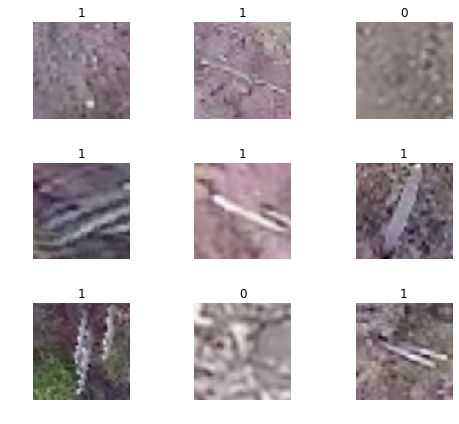

# Kaggle: Aerial Cactus Identification ([link](https://www.kaggle.com/c/aerial-cactus-identification))

__Data__: 17 500 aerial photos of columnar cacti

__Task__: predict the probability an image contains a columnar cactus

__Evaluation__: area under the ROC curve 

__Solution__: simple 2D-CNN

__Success__: 0.987 AUC

